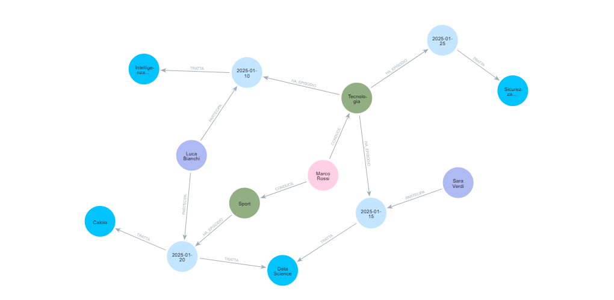
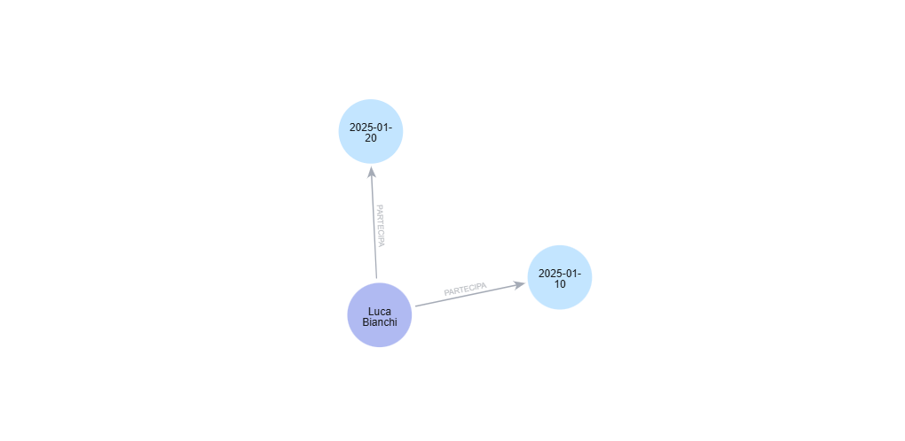
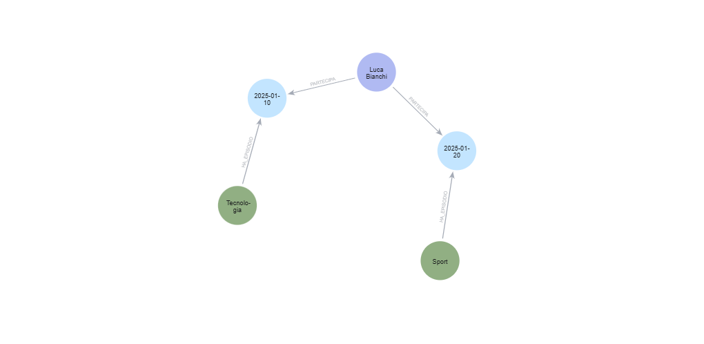
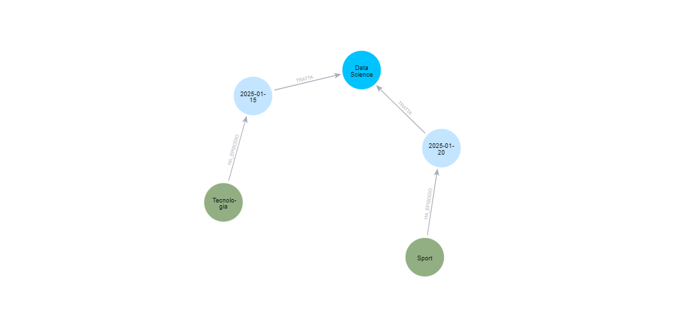

# Analisi del Database a Grafo - Podcast Library

## Introduzione

Questo documento analizza l'implementazione di un database a grafo in Neo4j per la gestione di una libreria di podcast. Il progetto utilizza Cypher, il linguaggio di query di Neo4j, per creare nodi, relazioni e interrogare il grafo.

---

## 1. Creazione dei Nodi

### Script: `01_create_nodes.cypher`

Il primo script si occupa della creazione delle entità principali del database a grafo. Vengono creati cinque tipi di nodi:

#### 1.1 Autore
- **Marco Rossi**: L'autore/conduttore principale dei podcast

#### 1.2 Podcast
- **Tech Talks**: Podcast di categoria "Tecnologia" in lingua italiana
- **Sport Inside**: Podcast di categoria "Sport" in lingua italiana

#### 1.3 Episodi
Sono stati creati 4 episodi con le seguenti caratteristiche:
- **Episodio 1**: "AI e futuro" (10/01/2025)
- **Episodio 2**: "Cloud e Big Data" (15/01/2025)
- **Episodio 3**: "Calcio moderno" (20/01/2025)
- **Episodio 4**: "Cybersecurity base" (25/01/2025)

#### 1.4 Ospiti
- **Luca Bianchi**: Ospite ricorrente
- **Sara Verdi**: Ospite

#### 1.5 Argomenti
Gli argomenti trattati nei vari episodi sono:
- Intelligenza Artificiale
- Data Science
- Calcio
- Sicurezza Informatica

---

## 2. Creazione delle Relazioni

### Script: `02_create_relationships.cypher`

Il secondo script stabilisce le connessioni tra i nodi creati, costruendo la struttura del grafo. Le relazioni create sono:

### 2.1 Relazione CONDUCE (Autore → Podcast)
- Marco Rossi conduce "Tech Talks"
- Marco Rossi conduce "Sport Inside"

### 2.2 Relazione HA_EPISODIO (Podcast → Episodi)
**Tech Talks** contiene:
- Episodio 1: "AI e futuro"
- Episodio 2: "Cloud e Big Data"
- Episodio 4: "Cybersecurity base"

**Sport Inside** contiene:
- Episodio 3: "Calcio moderno"

### 2.3 Relazione PARTECIPA (Ospiti → Episodi)
- **Luca Bianchi** partecipa all'Episodio 1 (Tech Talks) e all'Episodio 3 (Sport Inside)
- **Sara Verdi** partecipa all'Episodio 2 (Tech Talks)

> **Nota interessante**: Luca Bianchi è un ospite cross-podcast, partecipando sia a episodi di tecnologia che di sport.

### 2.4 Relazione TRATTA (Episodi → Argomenti)
- Episodio 1 → Intelligenza Artificiale
- Episodio 2 → Data Science
- Episodio 3 → Calcio **E** Data Science (tratta due argomenti!)
- Episodio 4 → Sicurezza Informatica

### 2.5 Visualizzazione del Grafo Completo

Dopo l'esecuzione degli script di creazione, il grafo risultante è visualizzato nell'immagine seguente:

**Query per visualizzare tutto il grafo**:
```cypher
MATCH (a)-[r]->(b)
RETURN a, r, b;
```



L'immagine mostra la struttura completa del database a grafo con tutti i nodi e le relative relazioni. Si può notare:
- Le connessioni tra l'autore e i podcast
- La distribuzione degli episodi tra i due podcast
- Le partecipazioni degli ospiti
- Gli argomenti associati a ciascun episodio

---

## 3. Query e Interrogazioni

### Script: `03_queries.cypher`

Il terzo script contiene le query per interrogare il database e ottenere informazioni specifiche.

> **💡 Esecuzione Automatizzata**: Le stesse query possono essere eseguite programmaticamente tramite lo script Python `grafo/python/neo4j_queries.py`. Questo script automatizza l'esecuzione delle tre query e restituisce i risultati in formato testuale sul terminale. Per istruzioni dettagliate sull'esecuzione, consulta il file [`how_to_run.md`](../how_to_run.md).

### 3.1 Query 1: Trovare tutti gli episodi di un ospite

**Obiettivo**: Trovare tutti gli episodi in cui compare l'ospite "Luca Bianchi"

```cypher
MATCH (o:Ospite {nome: "Luca Bianchi"})-[r:PARTECIPA]->(e:Episodio)
RETURN o, r, e;
```

**Risultato**:



La query restituisce:
- L'ospite Luca Bianchi
- Le relazioni PARTECIPA
- Gli episodi 1 ("AI e futuro") e 3 ("Calcio moderno")

**Interpretazione**: Luca Bianchi ha partecipato a 2 episodi, dimostrando competenze trasversali sia nel campo tecnologico che sportivo.

---

### 3.2 Query 2A: Podcast collegati per ospiti condivisi

**Obiettivo**: Individuare i podcast collegati perché condividono gli stessi ospiti

```cypher
MATCH (p1:Podcast)-[r1:HA_EPISODIO]->(e1:Episodio)<-[r2:PARTECIPA]-(o:Ospite)
      -[r3:PARTECIPA]->(e2:Episodio)<-[r4:HA_EPISODIO]-(p2:Podcast)
WHERE p1.titolo <> p2.titolo
RETURN p1, r1, e1, r2, o, r3, e2, r4, p2;
```

**Risultato**:



**Interpretazione**: La query identifica il collegamento tra "Tech Talks" e "Sport Inside" attraverso l'ospite Luca Bianchi. Questo tipo di analisi è utile per:
- Identificare sinergie tra podcast
- Scoprire ospiti che possono fare da ponte tra diverse tematiche
- Pianificare collaborazioni cross-categoria

---

### 3.3 Query 2B: Podcast collegati per argomenti comuni

**Obiettivo**: Individuare i podcast collegati perché trattano gli stessi argomenti

```cypher
MATCH (p1:Podcast)-[r1:HA_EPISODIO]->(e1:Episodio)-[r2:TRATTA]->(arg:Argomento)
      <-[r3:TRATTA]-(e2:Episodio)<-[r4:HA_EPISODIO]-(p2:Podcast)
WHERE p1.titolo <> p2.titolo
RETURN p1, r1, e1, r2, arg, r3, e2, r4, p2;
```

**Risultato**:



**Interpretazione**: La query rivela che "Tech Talks" e "Sport Inside" sono collegati attraverso l'argomento "Data Science":
- **Tech Talks** - Episodio 2 ("Cloud e Big Data") tratta Data Science
- **Sport Inside** - Episodio 3 ("Calcio moderno") tratta anche Data Science

Questo dimostra che:
- La Data Science è un argomento trasversale che può essere applicato anche allo sport (analisi statistiche, performance analytics, etc.)
- Esiste un collegamento tematico tra i due podcast nonostante appartengano a categorie diverse

---

## 4. Conclusioni e Osservazioni

### 4.1 Vantaggi del modello a grafo

L'implementazione tramite database a grafo (Neo4j) offre diversi vantaggi per questo caso d'uso:

1. **Relazioni naturali**: Le connessioni tra autori, podcast, episodi, ospiti e argomenti sono rappresentate in modo intuitivo
2. **Query flessibili**: Le query Cypher permettono di traversare il grafo in modo efficiente per scoprire collegamenti complessi
3. **Scoperta di pattern**: È facile identificare collegamenti inaspettati (es. podcast di categorie diverse collegati per argomenti comuni)
4. **Scalabilità**: Il modello può facilmente espandersi aggiungendo nuovi nodi e relazioni senza modificare la struttura esistente

### 4.2 Insights dal grafo

Dall'analisi emerge che:
- **Luca Bianchi** è un ospite versatile che partecipa a podcast di categorie diverse
- **Data Science** è un argomento trasversale che collega tecnologia e sport
- I podcast, pur essendo categorizzati diversamente, hanno connessioni a livello di contenuti e ospiti

### 4.3 Possibili estensioni

Il modello può essere arricchito con:
- Valutazioni e recensioni degli episodi
- Tag aggiuntivi per gli argomenti
- Relazioni temporali tra episodi
- Metriche di ascolto e engagement
- Sponsor e partnership

---

## 5. Riepilogo degli Script

| Script | Tipo | Funzione | Output |
|--------|------|----------|--------|
| `01_create_nodes.cypher` | Cypher | Creazione di tutti i nodi del grafo | 13 nodi creati |
| `02_create_relationships.cypher` | Cypher | Creazione delle relazioni tra nodi | 15 relazioni create |
| `03_queries.cypher` | Cypher | Interrogazioni analitiche sul grafo (esecuzione manuale) | 3 query con visualizzazione grafica |
| `neo4j_queries.py` | Python | Esecuzione automatizzata delle query | Output testuale delle 3 query |

### Modalità di Esecuzione

Il progetto offre **due modalità** per eseguire le query:

1. **Manuale/Visuale** (Neo4j Browser)
   - File: `03_queries.cypher`
   - Accesso: http://localhost:7474
   - Output: Visualizzazione grafica interattiva del grafo
   - Uso: Analisi esplorativa e documentazione visuale

2. **Automatizzata/Programmatica** (Script Python)
   - File: `python/neo4j_queries.py`
   - Esecuzione: Da terminale WSL tramite `python grafo/python/neo4j_queries.py`
   - Output: Risultati tabulari nel terminale
   - Uso: Automazione, testing, integrazione in pipeline

Per istruzioni dettagliate sull'esecuzione dello script Python, consultare [`how_to_run.md`](../how_to_run.md).

---

